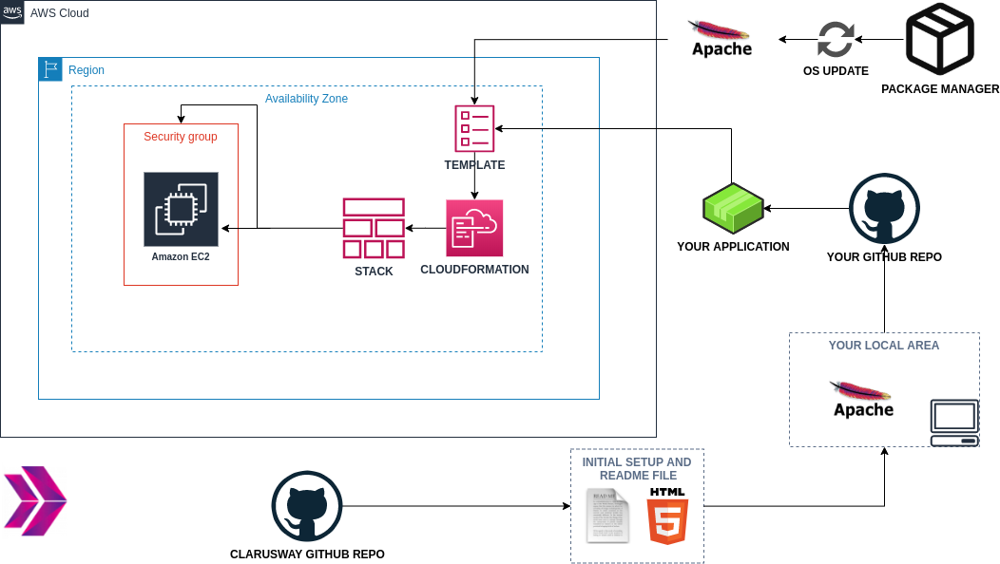
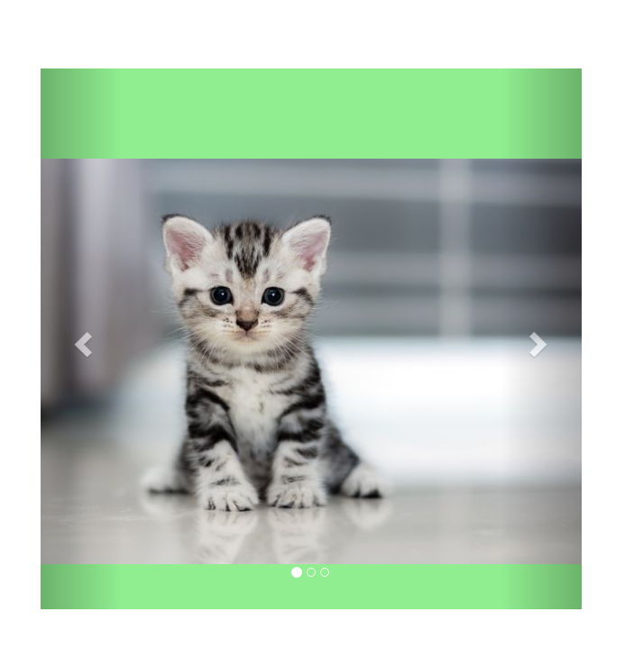

# Project-101 : Kittens Carousel Static Website deployed on AWS EC2 using Cloudformation

## Description
Kittens Carousel is a static website application deployed with Apache Web Server on AWS Elastic Compute Cloud (EC2) Instance using AWS Cloudformation Service. 

## Problem Statement



- In this project I had a given basic static website consisting of an index.html, 3 cutes pictures of kittens, some css that enable a caroussel behavior using bootstrap. I supposed the static web site necessary files was already pushed to the repository on GitHub.

- The goal of the project is to deploy the static web site (the `index.html` and an images given within the `static-web` folder) in an EC2 instance (that may be a dev environment), to show case the website. The web site will be deployed on Apache Web Server, hosted by the instance.

   - Application will be deployed in the development environment on AWS EC2 Instance using AWS Cloudformation Service. The Cloudformation template is configured using the following,

      - The application stack should be created with new AWS resources. 
   
      - The application should run on the latest version of Amazon Linux 2023 Image. The challenge here is to automatically get the latest Amazon Linux 2023 image id. Here is the link where you can find information about this challenge. But, since we need Amazon Linux 2023 AMI, we need to change some parameters belonging to Amazon Linux 2 in this article seen below.
        
         https://aws.amazon.com/blogs/compute/query-for-the-latest-amazon-linux-ami-ids-using-aws-systems-manager-parameter-store/
        
      - EC2 Instance type can be configured as `t2.micro`.

      - Instance launched by Cloudformation should be tagged `Web Server of StackName` 

      - The Web Application should be accessible via web browser from anywhere.

      - The Application files should be downloaded from the Github repo and deployed on the EC2 Instance using user data script within Cloudformation template. 

      - Kittens Carousel Application Website URL should be given as output by Cloudformation Service after the stack is created.

## Project Skeleton 

```
101-kittens-carousel-static-website-ec2 (folder)
|
|----readme.md         # Definition of the project       
|----cfn-template.yml  # Cloudformation template
|----static-web
        |----index.html  # HTML file
        |----cat0.jpg    # image file
        |----cat1.jpg    # image file
        |----cat2.jpg    # image file
```

## Expected Outcome



### This project covers following topics;

- Apache Web Server Installation on Linux

- Static Website Deployment

- Bash scripting

- AWS EC2 Service

- AWS Security Groups Configuration

- AWS Cloudformation Service

- AWS Cloudformation Template Design

- Git & Github for Version Control System


## Steps to Solution
  
- Step 1: Create a public repo on Github 

- Step 2: Create project folder for local public repo on your pc

- Step 3: Prepare a cloudformation template to deploy your app on EC2 Instance

- Step 4: Push your application into your own public repo on Github

- Step 5: Deploy your application on AWS Cloud using Cloudformation template to showcase your app within your team.

## Resources

- [AWS Cloudformation User Guide](https://docs.aws.amazon.com/AWSCloudFormation/latest/UserGuide/Welcome.html)
