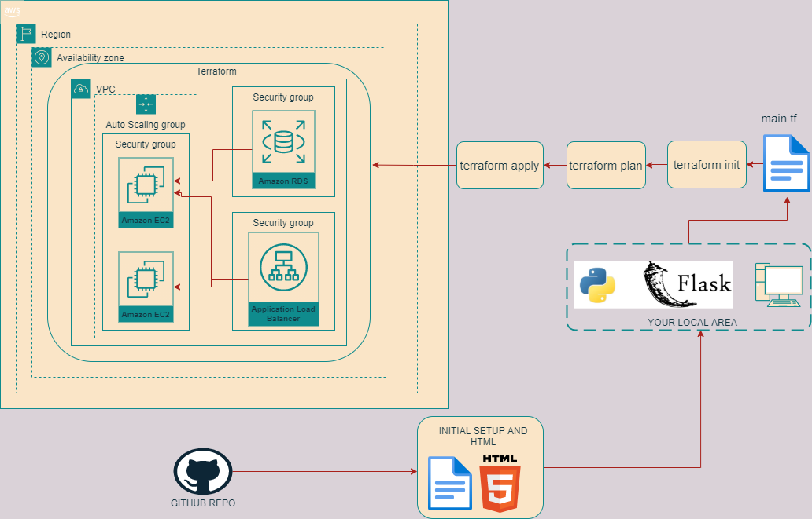

# Infrastructure Provisioning for a Scalable Web Application

The purpose of this project is to deploy a simple phonebook application on a AWS infrastructure provisionned by a terraform config file.

## Web application
    - The web application is written in python and served via Flask. it uses a AWS RDS MySQL database instance
    - The application offer to add, delete and search phonebook entries
    - Github is used as version control system.

## Terraform 
The Terraform IaC configuration showcases the automated provisioning of a production-ready infrastructure deployment on Amazon Web Services (AWS). The infrastructure is designed to support the web application with high availability, security, and scalability.

## Key Components

1. **Application Load Balancer (ALB):**
   - Distributes incoming traffic across multiple instances of the web application.
   - Configured as an internet-facing Application Load Balancer using IPv4 addressing.

2. **ALB Listener:**
   - Configured for HTTP traffic (port 80).
   - Forwards requests to the target group.

3. **ALB Target Group:**
   - Defines the targets for the incoming web traffic.
   - Provides health checks to ensure only healthy instances receive traffic.

4. **Auto Scaling Group (ASG):**
   - Manages a pool of EC2 instances that run the "Phonebook" application.
   - Ensures application availability and scales up/down as needed based on demand.

5. **Launch Template:**
   - Serves as a blueprint for launching EC2 instances within the ASG, defining their size, AMI, key pair, and security groups.
   - Includes user-data script (userdata.sh) to execute bootstrapping operations upon instance launch.

6. **Database Server (RDS):**
   - Provides a MySQL database instance (backed by RDS) for application data persistence.
   - Configured with appropriate security groups and backup settings.

7. **GitHub Integration:**
   - Upon deployment, exports the database endpoint address to the GitHub repository using the github_repository_file resource.

8. **DNS Configuration:**
   - Creates a Route53 record to map a user-friendly DNS name to the load balancer, facilitating application access.

## Workflow

1. Upon execution (terraform apply), Terraform analyzes the configuration and generates an execution plan.
2. AWS resources are provisioned in the order of their dependencies (e.g., VPC and subnets are created before load balancer).
3. EC2 instances launch within the ASG, using the provided Launch Template.
4. Applications are bootstrapped on instances using the user-data script, configuring them to connect to the database.
5. The database endpoint is published to the designated GitHub repository.
6. The Route53 record directs user traffic to the Application Load Balancer.